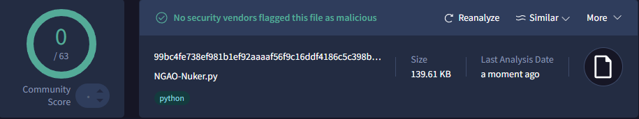
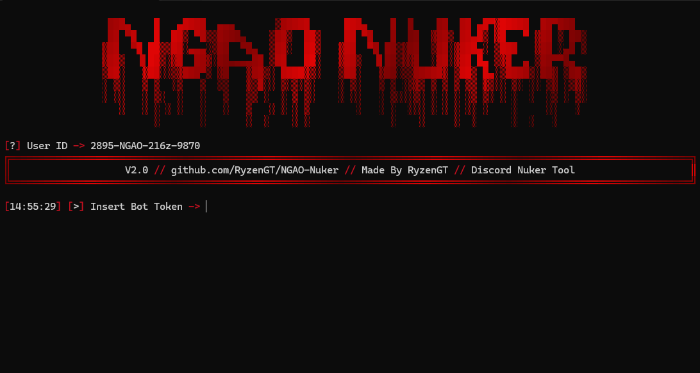
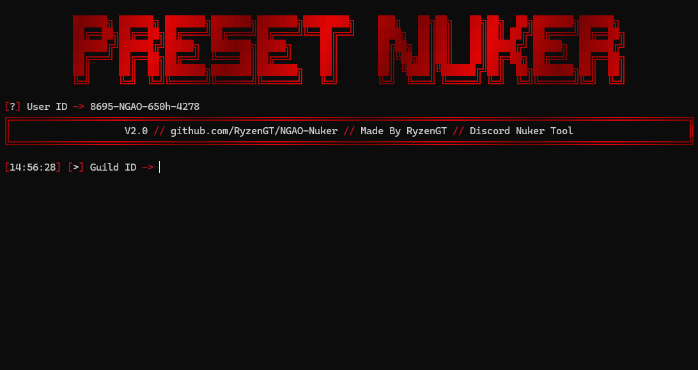
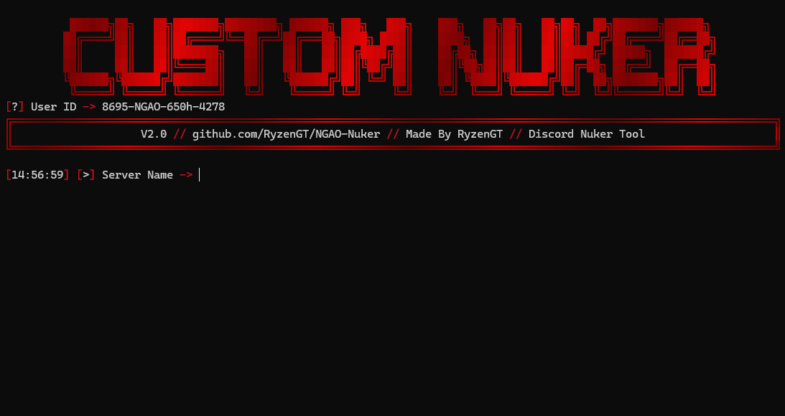
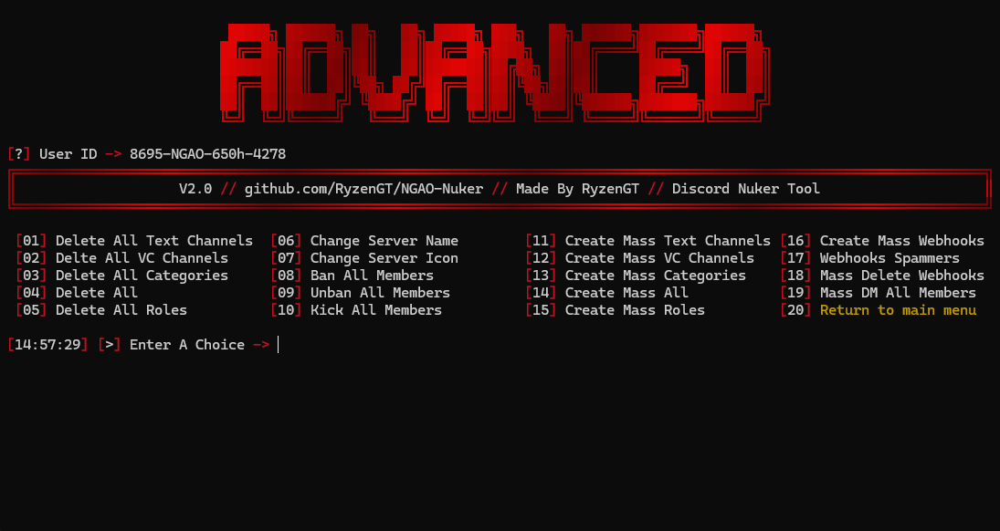

<h1 align="center">NGAO-Nuker / By RyzenGT 
</h1>

## 🔧 Instructions:
- Install [Python](https://www.python.org/ftp/python/3.13.3/python-3.13.3-amd64.exe) and add to PATH.
- [Download](https://github.com/RyzenGT/NGAO-Nuker/releases/latest) the `.zip` file and place all the files in a single folder.
- Make sure `NGAO-Nuker.py` and `Configuration.json` are grouped together.
- Double-click `NGAO-Nuker.py`.
- The tool is ready to launch, **enjoy!**

> **Discord Nuker Tool developed by RyzenGT — powerful, fast, and beautiful**\
> *Send me a DM if there's any problem :* `kng.sgao`

## 🧨 Included Modules:

| Module              | Available Actions                                                              |
| ------------------- | ------------------------------------------------------------------------------ |
| **Channels**        | Delete all text/voice channels, delete categories, create mass text/voice/cat. |
| **Roles**           | Delete all roles, create mass roles, give admin rights to everyone             |
| **Members**         | Ban all, kick all, unban all, mass DM all members                              |
| **Server Settings** | Change server name and icon                                                    |
| **Webhooks**        | Create mass webhooks, spam via webhooks, delete all webhooks                   |
| **Mass Creation**   | Create all (text + voice + roles + categories) in one go                       |

***And More..***

## 📸 Menu Picture:

  

   
  

## ⚠️ Disclaimer:

> This project is for **educational purposes only**.\
> The author **is not responsible** for any misuse.\
> You are solely responsible for what you do with this tool.